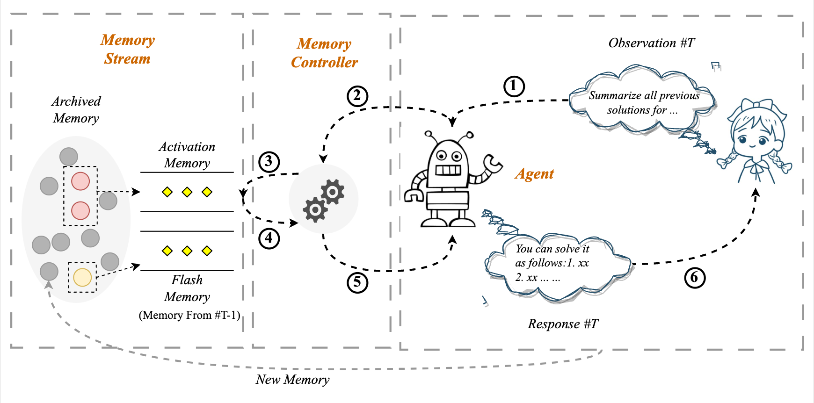

# Unleashing Infinite-Length Input Capacity for Large-scale Language Models with Self-Controlled Memory System

In this paper, we introduce the **Self-Controlled Memory (SCM)** system to unleash infinite-length input capacity for large-scale language models.
Our SCM system is composed of three key modules: the language model agent, the memory stream, and the memory controller. 




# 🏴󠁶󠁵󠁭󠁡󠁰󠁿 Overview

Our SCM system can be integrated with any LLMs to enable them to process ultra-long texts without any modification or fine-tuning. 


## Supported Tasks

| Tasks                            |            Status            |
| -------------------------------- | :--------------------------: |
| Long-Term Dialogue               | :white_check_mark: Supported |
| Ultra-long Book Summarization    | :white_check_mark: Supported |
| Ultra-long Meeting Summarization | :white_check_mark: Supported |


# ⚡️ Usage

## config

In `config` directory, copy `apikey.txt.template` to `apikey.txt`, put your openai apikey in it, support multiple keys. This file is ignored to protect privacy.

Note: If the ChatGPT service is unavailable in your area, please utilize proxy settings. Copy `config\api_config.template.json` to `config\api_config.json` and config `http_proxy` as you like.

## Requirements

The key requirements are as below:

- python 3.8+
- openai 0.27.0+
- gradio 3.27.0+

Use conda to create environment.
```shell
conda create -n scm python=3.8 -y
conda activate scm
```

You can install the requirements by running:
```shell
pip install -r requirements.txt
```

## Run

Default agent model use `text-davinci-003`.

You can specify model by `--model_name`, current support model list: 
- `text-davinci-003`
- `gpt-3.5-turbo`


### 👻Long-Term Dialogue

Run this command, chat with model. Chat logs are recorded in `logs\log.txt`.

```bash
python dialogue_demo.py
```

Functional command during dialogue, these operations will be silently done, you can see them in the log output:
- `reset` or `清空`: clear dialogue history.
- `export` or `导出`: save the dialogue history to files.
- `roll back` or `回滚`: pop previous turn dialogue.

### 📚Ultra-long Book Summarization

Take the shortest book `The Old Man and the Sea`, whose content cost 34k tokens, as a demo example:
```bash
python book_summary.py   --book_files data/book/EnglishBook/The_Old_Man_and_the_Sea.txt
```

### 📝Ultra-long Meeting Summarization

Take the blockchain meeting as example, whose content cost 37k tokens, as a demo example:
```bash
python meeting_summary.py --meeting_ids 26231372_区块链技术的应用前景 --no_scm
```

## Evaluation Dataset

Data files are in `data` folder.

|                | Dialogue | Book  | Meeting |
|----------------|----------|-------|---------|
| \#Instances    | 18       | 10    | 20      |
| Max tokens     | 34k      | 2M    | 50k     |
| Total tokens   | 420k     | 8M    | 632k    |
| Max turn       | 200      | -     | 80      |
| Language       | En+Zh    | En+Zh | Zh      |

Evaluation dataset statistics. 2M means 2 miillion token count.

